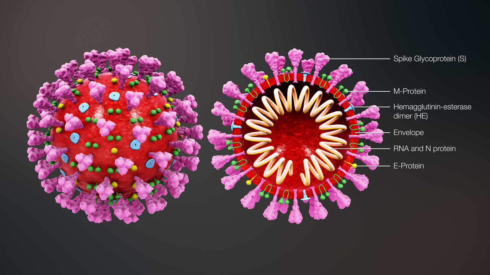

# Detecting COVID-19 in Chest X-ray Images

 
 
### Why:
COVID-19 has hit the world and researchers all over the world try to find ways to tackle the virus. 
A common application today is the analysis of body X-ray images to help doctors detect diseases. The goal is not to do decisions solely based on these analysis but to provide an experienced doctor with suggestions what images might be of high interest. 

This work was highly motivated by a beautiful blog article, which can be found here: 
https://www.pyimagesearch.com/2020/03/16/detecting-covid-19-in-x-ray-images-with-keras-tensorflow-and-deep-learning/

#### Only for educational purposes
Please note:
As the author of the referenced blog article says:<i>"The methods and techniques used in this post are meant for educational purposes only. This is not a scientifically rigorous study, nor will it be published in a journal."</i>

The same restrictions apply here. 
This work is not meant to be part of a production system but should show how modern computer vision technology could help in medical areas.

### Data:
The data was taken from two sources:
1. [https://github.com/ieee8023/covid-chestxray-dataset]("COVID-19 image data collection on GitHub") - contributions welcome!
2. [https://www.kaggle.com/paultimothymooney/chest-xray-pneumonia](Chest X-Ray Images (Pneumonia) on Kaggle)

1. [COVID-19 image data collection on GitHub - contributions welcome!](https://github.com/ieee8023/covid-chestxray-dataset)
2. [Chest X-Ray Images (Pneumonia) on Kaggle](https://www.kaggle.com/paultimothymooney/chest-xray-pneumonia)
