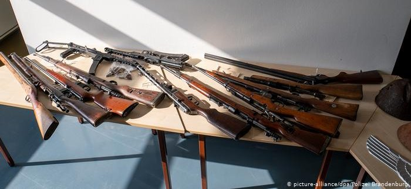

# Detecting Weapons on Images
  

### Why:
Social media such as Facebook, WhatsApp and WeChat are wonderful ways to communicate with people all over the world.
Unfortunately these platforms are also used by criminals which is the reason why crime fighters want to investigate the contents on these platforms.

Now, imagine being part of an investigation group of the police that is responsible to fight weapon crimes.
You have scraped data from various channels, e.g. Twitter, Facebook, WeChat & Co. and now you're sitting on a huge pile of images not knowing where to start looking.
Manually investigating these data sources is impossible, due to their size and variety.

That's the reason why we try to incorporate computer vision technology to automatically detect weapons on images, allowing the investigation officers to focus on the relevant images and their sources.
This not only saves manual effort but also enables officials to better protect the law.

In this demo I train a ResNet-50 image classifier to detect weapons and feed the image classification results into SAS Visual Analytics.

### Data
The training images were taken from Kaggle: 
[Kaggle Weapons Dataset](https://www.kaggle.com/mohamedmaher1997/weapons)

### Demo
Demo videos can be found here:
* Use Image Classification results in SAS Visual Analytics for efficient investigations

### Further Ressources
[Medium.com Article](https://medium.com/@michaelgorkow/track-social-distancing-using-computer-vision-2032d35cbcb4)
