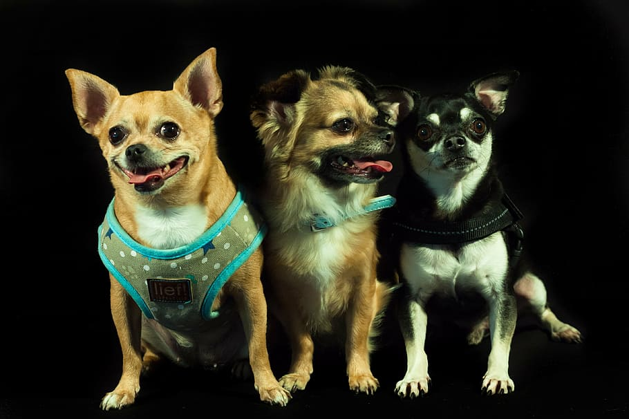

# Classifying Dog Breeds on Images
  
### Why:
Have a look at this article: https://www.theinsurancealliance.com/10-dog-breeds-your-insurance-company-doesnt-like/ 
Some insurance companies don't want to insure certain dog breeds because they are known to be riskier than others. 
A possible solution to this problem is to ask the dog owner to provide details about the dog breed - but how can you make sure that these details were right?

An idea could be to have the dog owner provide images of the dog. But now the question comes up: Who will look at these images and determine the breed? 
While you could hire an expert for dog breeds and have him classify all the images, it may not be the most efficient process. 
Instead you could try to develop a computer vision model that is able to detect the breed automatically and also provides a probability how likely its predictions is. 

The experts can focus on images where the model's probability was low - saving them time by not having to look at all images. 
After they've classified the difficult images with their expert knowledge, you can use these new labeled data to further improve your model.

This way you can save a lot of manual effort and speed up the approval process - making dog owners happy. :)

### Data:
This data was taken from Kaggle and is a subset of the ImageNet dataset. Link: https://www.kaggle.com/c/dog-breed-identification  
It originally contains 120 different dog breeds but it was downsampled to only 16 classes to save training time.